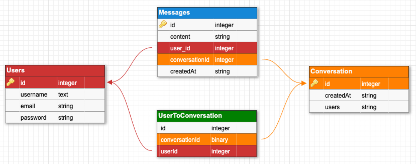
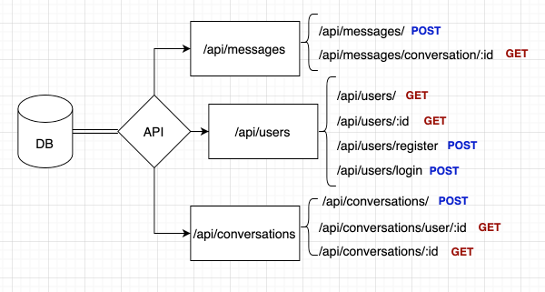
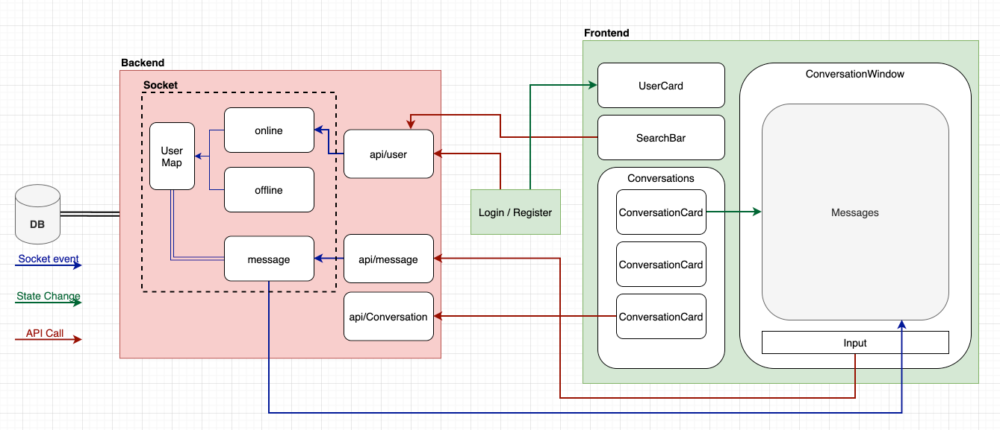

# A Web-based Messenger App

### Features

- Real-time messaging
- Offline message
- User login/register

### Stack

- React + NodeJS + PostgresDB

### Library & Frameworks

- Material-UI
  - Grid system, theme
  - Form validation, error handling
- Express.js
  - API endpoints, middleware
- Sequelize
  - Database modeling
- JWT webtoken
- Socket.io
- Axios
- React-router-dom

---

## Database

- A user table storing user information, password is hashed
- A conversation table storing conversations. The users field is set up to hold a unique string for indentifying the users in the conversations, which prevent duplicates conversations to be created.
- A userToConversation table is maintaining a many to many relationship between users and conversations.
- A message table storing messages

  

---

## Backend

- /api/users
- /api/messages
- /api/conversations

  

A Postgres server needs to be installed as well as pgAdmin for setting up the local environment.

A local env file is required to set up the connection to the database.

env example:

```
DB_NAME=messenger
DB_PASSWORD=Monday12
DB_USERNAME=postgres
DB_HOST=localhost
HASH_ROUNDS=4
JWT_SECRET=asampleofjwt
SOCKET_TOKEN=socketToken
```

---

## Frontend

- User login/register triggers a socket online event
- A in-memory user map storing userId to socketId mapping
- User's message triggers a socket message event. If the receiver is online, the message will emit to the receiver.
- Offline message is storing in the database

  
